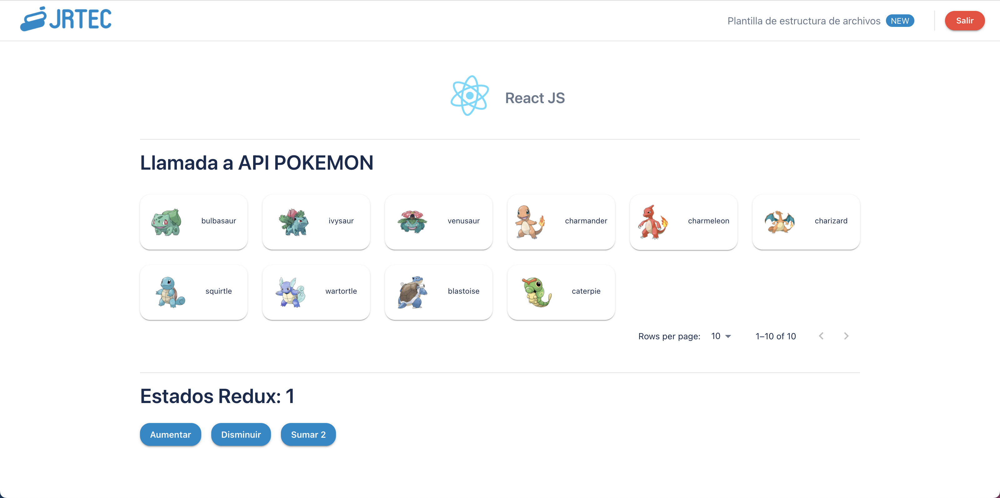

# Basic structure for a React App using CRA

This is a project template which uses and already has the following packages configured:

- [Redux Toolkit](https://redux-toolkit.js.org/)
- [react-router-dom v6](https://reactrouter.com/) 
- [RTK-query](https://redux-toolkit.js.org/tutorials/rtk-query)
- [MUI5](https://mui.com/getting-started/installation/)
- [Formik](https://formik.org/)
- [Yup](https://github.com/jquense/yup)
- [Redux-persist](https://github.com/rt2zz/redux-persist#readme)
- [redux-persist-transform-encrypt](https://github.com/maxdeviant/redux-persist-transform-encrypt)
- [camelcase-keys](https://github.com/sindresorhus/camelcase-keys)
- [snakecase-keys](https://github.com/bendrucker/snakecase-keys)

This projects also uses a middleware on RTK-query to connect a React application with a snake case python backend.

[Live Demo](https://react-app-template-jrtec.web.app/home)

# Clone the project

```sh
git clone https://github.com/kabirivan/React-App-Template
```

## Setup
### Requirements
Node >= 12

### Set environment variables

Create an **.env.development** and **.env.production** files on root folder and copy the content from **.env.example**. Feel free to change it according to your own configuration for development and production.

### Install packages

On the root folder run:

```sh
yarn install
```

### Start the project on development mode 
In this mode the app reads and uses the **.env.development** environment variables
Open [http://localhost:3000](http://localhost:3000) to view it in the browser.

```sh
yarn start:development
```

### Start the project on production mode 
In this mode the app reads and uses the **.env.production** environment variables
Open [http://localhost:3000](http://localhost:3000) to view it in the browser.

```sh
yarn start:production
```

### Test the code

```sh
yarn test
```
Launches the test runner in the interactive watch mode.\
See the section about [running tests](https://facebook.github.io/create-react-app/docs/running-tests) for more information.

### Run a static code analisys

In order to run more sophisticated static analysis, you can follow the instructions on [this post](https://medium.com/jrtec/static-analysis-using-sonarqube-in-a-react-webapp-dd4b335d6062) for more information.

### Create a production bundle

Builds the app for production to the `build` folder.\
It correctly bundles React in production mode and optimizes the build for the best performance.

The build is minified and the filenames include the hashes.\
Your app is ready to be deployed! It uses .env.production credentials

```sh
yarn build
```

See the section about [deployment](https://facebook.github.io/create-react-app/docs/deployment) for more information.

## Preview
  
<p align="center">
  
</p>


### Firebase CI/CD using github actions

You can edit the workflow on **.github/workflows/main.yml**

The following secrets should be configured on github. It uses [borales/actions-yarn@v2.3.0](https://github.com/Borales/actions-yarn), [w9jds/firebase-action@master](https://github.com/w9jds/firebase-action)  and [act10ns/slack@v1](https://github.com/act10ns/slack).

```sh
REACT_APP_BACKEND_ENDPOINT
REACT_APP_ENCRYPT_STORAGE
REACT_APP_REDUX_SECRET_KEY
REACT_APP_JWT_SECRET
PORT
SLACK_WEBHOOK_URL
FIREBASE_TOKEN
```

You can check [here](https://www.youtube.com/watch?v=WuWsg0Ldess&ab_channel=MerowareInstance) how to configure secrets on github account


## TODO List:

- [x] Add redux toolkit setup
- [x] Add encrypt storage
- [x] Add JWT authentication
- [x] Add RTK-Query for data fetching
- [x] camelcase-keys and snakecase-keys middlewares
- [x] Add Redux persist with encryption for storage
- [x] Add Formik form example
- [x] Add MUI5
- [x] Add eslint
- [x] Add sonarqube for static code analysis
- [x] Github action for CI/CD on firebase
- [ ] Add a moment example
- [ ] Add a Formik example with Yup

PR are welcome ❤️

## License

[](http://badges.mit-license.org)

- This project is licensed under the terms of the **[MIT license](LICENSE)**
